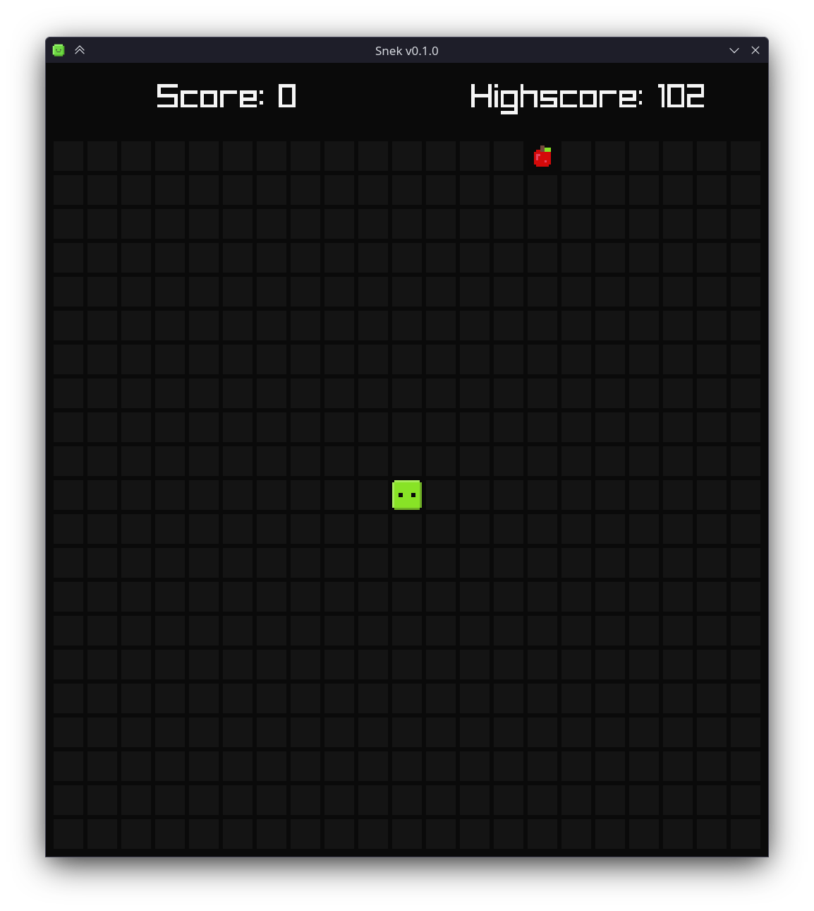
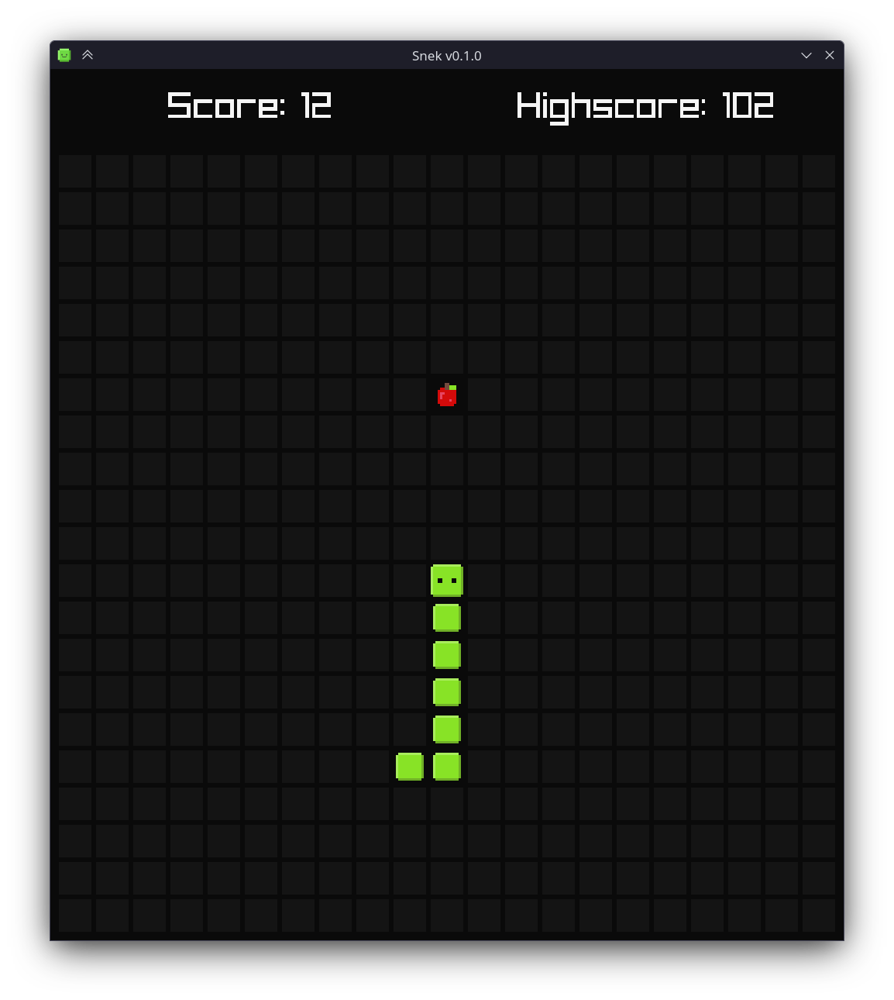
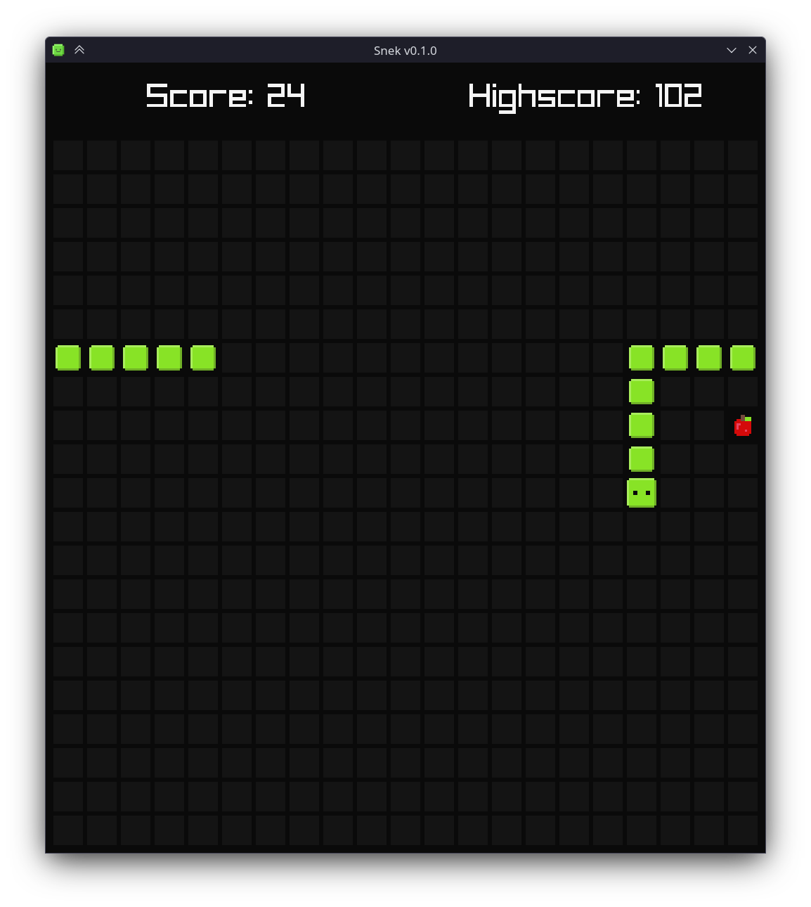
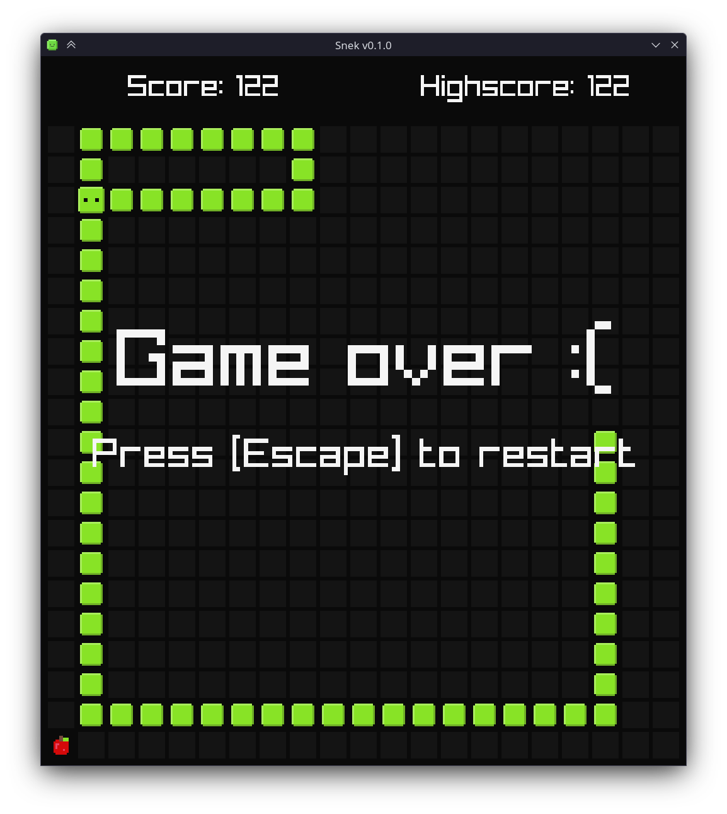

# Snek

## About

**Snek** is a basic snake game written in [Nim](https://nim-lang.org/) using [raylib](https://www.raylib.com/).

## Installation

`nimble install https://github.com/nirokay/Snek` or from the releases page.

## Features

Some Snake features made it into **Snek**:

* Grace-frame before the snake eats itself
* Screen wrap

## Screenshots

|        |                            |
|-----------------------------------|---------------------------------------------------------|
|  |  |

## Licence

This project is distributed under the GPL-3.0 licence.
